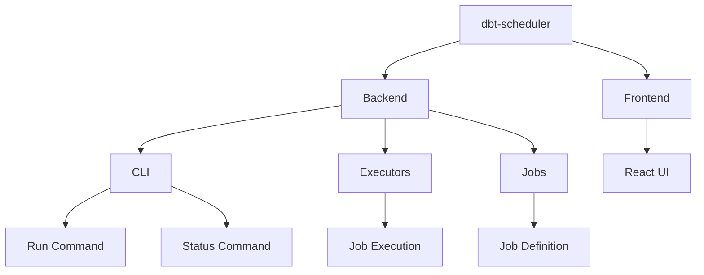

## dbt Scheduler

### Project Overview
Kube-Native Scheduler with dbt - A daemon process that manages and schedules dbt jobs in Kubernetes environments.

### Features
- Daemon process management for dbt job scheduling
- CLI interface for easy control
- Kubernetes-native deployment support
- Web UI for monitoring and management (React-based frontend)
- Process status monitoring
- PID-based process management

### Prerequisites
- Python 3.10+
- Poetry for dependency management
- Node.js 20.15.1+ for frontend
- Kubernetes cluster (for deployment)

### Installation
1. Clone the repository
2. Install backend dependencies:
   ```bash
   poetry install
   ```
3. Install frontend dependencies:
   ```bash
   cd frontend
   yarn install
   ```

### Structure


### Development
1. Start the backend development server:
   ```bash
   poetry run dbt-scheduler run
   ```

2. Start the frontend development server:
   ```bash
   cd frontend
   yarn start
   ```

3. For daemon mode:
   ```bash
   poetry run dbt-scheduler run --daemon
   ```

### Contact
For questions and support, please contact:
- Maintainer: jx2lee <dev.jaejun.lee.1991@gmail.com>

